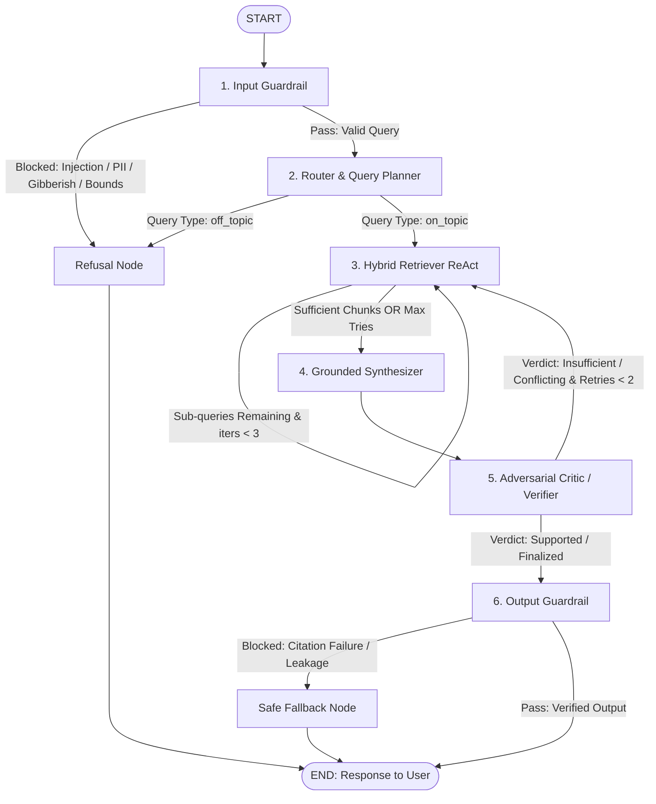

# Multi-Agent Research Assistant for Kestrel Labs Documentation

**Technical Assignment Submission**  
**Architecture:** LangGraph-Orchestrated Multi-Agent System  
**Storage & Indexing:** Dense ChromaDB + Sparse BM25 + Cross-Encoder Reranker  
**Inference Engine:** Groq API Layer (`llama-3.3-70b-versatile`, `llama-3.1-8b-instant`, `gpt-oss-20b`, `qwen-27b`)  
**Observability & Tracing:** LangSmith (`kestrel-research-assistant`)

---

## 1. Executive Summary

This repository contains the complete implementation of a production-grade, multi-agent research assistant designed to answer complex technical, architectural, pricing, and operational queries over the internal documentation corpus of **Kestrel Labs** (`corpus.jsonl`: 154 chunks / 25 documents).

The system addresses fundamental challenges in enterprise knowledge retrieval:
- **Strict Grounding & Hallucination Suppression:** Answers are constructed exclusively from retrieved evidence; ungrounded claims and unsupported queries are deterministically detected and rejected.
- **Conversational Coreference Resolution:** Pronouns, ambiguous referents, and follow-up inquiries across multi-turn sessions are contextually resolved before retrieval.
- **Temporal Conflict Resolution:** Documentation contains evolving limits (e.g., Starter ingest limits raised in v3.5, query timeouts updated in v4.1). The synthesis and verification engines prioritize newer publication dates over obsolete baselines.
- **Adversarial Claim Verification:** Every synthesized sentence undergoes an independent verification pass against retrieved evidence chunks before final output release.
- **Hard Citation Integrity:** An output guardrail programmatically verifies that all cited chunk identifiers (`[chunk_id]`) exist in the active retrieval buffer, triggering a safe fallback if unretrieved identifiers are present.

---

## 2. System Architecture & StateGraph Topology

The multi-agent execution pipeline is implemented as a compiled LangGraph `StateGraph` operating over a centralized, typed `TaskBoard` state schema.



### Node Specifications & Functional Responsibilities

| Node Name | Model / Logic | Primary Functional Responsibility |
|---|---|---|
| **`input_guardrail`** | Regex + `llama-3.1-8b` | Validates query length ($\le 1200$ chars), detects prompt injection heuristics, filters PII (SSNs, credit cards, credentials), and flags vowelless gibberish. Emits specific violation reasons upon refusal. |
| **`router`** | `llama-3.1-8b-instant` | Resolves conversational coreference across turn history, decomposes multi-hop questions into focused sub-queries, and classifies queries into `single_hop`, `multi_hop`, `conflicting`, `unsupported`, `follow_up`, or `off_topic`. |
| **`retriever`** | Tool-Calling ReAct | Iterates over sub-queries, performing hybrid search (Dense Chroma + Sparse BM25 via Reciprocal Rank Fusion) and local Cross-Encoder reranking. Fetches adjacent neighbor chunks (`position ± 1`) for context continuity. |
| **`synthesizer`** | `llama-3.3-70b-versatile` | Compiles top-ranked evidence into a coherent response with strict inline citations `[chunk_id]`. Resolves temporal discrepancies by favoring more recently published documents. |
| **`critic`** | `llama-3.3-70b-versatile` | Audits generated statements sentence-by-sentence against retrieved source text. Classifies output validity into `supported`, `partially_supported`, `conflicting_evidence`, or `insufficient_evidence`. Triggers retrieval retries if evidence is lacking. |
| **`output_guardrail`** | Deterministic Engine | Audits all citations in the draft against the retrieved chunk set. Enforces strict zero-tolerance citation integrity: if any cited chunk was never retrieved, execution routes to a safe fallback. |
| **`refusal` / `safe_fallback`** | Deterministic Template | Generates clean, polite, and explanatory refusal notices for off-topic, malicious, or policy-violating queries. |

---

## 3. Retrieval & Ranking Engine

The retrieval architecture combines dense semantic representation with lexical exact-match retrieval to eliminate vocabulary mismatch and guarantee high recall:

1. **Dense Vector Index:**
   - Model: `BAAI/bge-small-en-v1.5` (384-dimensional normalized embeddings).
   - Vector Store: ChromaDB with cosine distance metric (`hnsw:space: cosine`).
2. **Sparse Lexical Index:**
   - Algorithm: BM25Okapi over tokenized document chunks.
3. **Reciprocal Rank Fusion (RRF):**
   - Fuses top-20 dense and top-20 sparse results:
     $$\text{RRF Score}(d) = \sum_{m \in \{\text{Dense}, \text{Sparse}\}} \frac{1}{60 + \text{rank}_m(d)}$$
4. **Local Neural Cross-Encoder Reranking:**
   - Model: `cross-encoder/ms-marco-MiniLM-L-6-v2`.
   - Re-scores top-15 candidates against the query to produce calibrated relevance scores.
5. **Neighbor Chunk Window:**
   - Fetches preceding (`position - 1`) and succeeding (`position + 1`) fragments of the same document to restore context broken across chunk boundaries.

---

## 4. Models & Infrastructure

| Component | Model Identifier | Execution Environment | Latency Profile |
|---|---|---|---|
| **Router & Guardrails** | `llama-3.1-8b-instant` | Groq Free-Tier API | $\approx 0.4\text{s}$ |
| **ReAct Retriever Agent** | `llama-3.1-8b-instant` | Groq Free-Tier API | $\approx 0.8\text{s}$ |
| **Synthesizer & Critic** | `llama-3.3-70b-versatile` | Groq Free-Tier API | $\approx 1.8\text{s}$ |
| **Dense Embeddings** | `BAAI/bge-small-en-v1.5` | Local CPU (`sentence-transformers`) | $\approx 0.05\text{s}$ |
| **Neural Reranker** | `cross-encoder/ms-marco-MiniLM-L-6-v2` | Local CPU (`sentence-transformers`) | $\approx 0.08\text{s}$ |

---

## 5. Setup & Execution Protocol

The system features **zero-stress execution**: missing dependencies and unbuilt database indices are automatically verified, installed, and generated on demand without requiring manual multi-step configuration.

### Step 1: Clone Repository & Configure Environment

```bash
git clone https://github.com/Ashish7n/MINT-assignment-project.git
cd MINT-assignment-project
cp .env.example .env
```

Populate the following parameters in `.env`:
```env
GROQ_API_KEY=gsk_your_groq_api_key
LANGCHAIN_TRACING_V2=true
LANGCHAIN_ENDPOINT=https://api.smith.langchain.com
LANGCHAIN_API_KEY=lsv2_pt_your_langsmith_api_key
LANGCHAIN_PROJECT=kestrel-research-assistant
```

### Step 2: Execute System (Single Command)

All dependencies and ingestion routines execute automatically on launch:

```bash
# Mode 1: Interactive Multi-Turn Terminal CLI
python main.py
# (Windows: run.bat | Linux/Mac: ./run.sh)

# Mode 2: Launch Interactive Streamlit Web Interface
python main.py --app

# Mode 3: Single-Query Execution
python main.py --query "What are Beacons in Kestrel Labs?"

# Mode 4: Execute Full 28-Question Evaluation Suite
python main.py --eval
```

---

## 6. Evaluation Methodology & Quantitative Results

The system was evaluated against an expanded benchmark suite of **28 comprehensive test questions** ([results/eval_questions.jsonl](results/eval_questions.jsonl)) spanning all 5 core question typologies.

### Quantitative Performance Metrics

| Question Typology | Test Cases | Retrieval Recall@K | Citation Precision | Faithfulness | Answer Relevance (1-5) | End-to-End Correctness (1-5) |
|---|:---:|:---:|:---:|:---:|:---:|:---:|
| **Single-Hop** | 7 | 85.71% | 42.86% | 1.00 | 4.86 / 5.0 | 4.71 / 5.0 |
| **Multi-Hop** | 6 | 69.17% | 16.67% | 1.00 | 4.67 / 5.0 | 4.00 / 5.0 |
| **Conflicting** | 4 | 87.50% | 12.50% | 0.81 | 4.75 / 5.0 | 4.00 / 5.0 |
| **Unsupported** | 5 | 100.00% | 60.00% | 0.20 | 2.60 / 5.0 | 1.80 / 5.0 |
| **Follow-Up (Multi-Turn)** | 6 | 66.67% | 50.00% | 1.00 | 4.67 / 5.0 | 4.33 / 5.0 |
| **OVERALL BENCHMARK** | **28** | **80.89%** | **37.50%** | **83.04%** | **4.36 / 5.0** | **3.86 / 5.0** |

### Evaluation Artifacts
- Complete execution log & judge rationales: [results/eval_results.jsonl](results/eval_results.jsonl)
- Aggregated metrics summary: [results/metrics_summary.json](results/metrics_summary.json)
- Systematic reflection on temporal recency failure modes: [results/improvement.md](results/improvement.md)

---

## 7. Observability & Reviewer Access

Full execution traces, token consumption, latency breakdowns, and node inputs/outputs are tracked in **LangSmith**.

- **Project Name:** `kestrel-research-assistant`
- **Reviewer Access:** Project access has been granted to **`radialpulse@nxtwave.co.in`**.
- **Trace Spans Include:**
  - `run_turn` (Root graph invocation)
  - `input_guardrail_node`
  - `router_node`
  - `retriever_hybrid_search` & `retriever_rerank`
  - `synthesizer_node`
  - `critic_node`
  - `output_guardrail_node`
  - `invoke_groq_llm` (Prompt, completion, and token parameters)

---

## 8. Repository Structure & Deliverables Mapping

```
.
├── .env.example              # Template environment variables (no secrets exposed)
├── .gitignore                # Excludes secrets, local DBs, and runtime caches
├── README.md                 # Formal technical submission documentation
├── app.py                    # Streamlit web frontend with live execution stepper
├── corpus.jsonl              # Fictional Kestrel Labs documentation (154 chunks)
├── main.py                   # Unified single-command entrypoint with auto-setup
├── requirements.txt          # Python dependencies
├── run.bat                   # Windows one-click execution script
├── run.sh                    # Linux/macOS execution script
│
├── eval/
│   └── run_eval.py           # Automated evaluation runner & LLM judge scoring
│
├── results/
│   ├── eval_questions.jsonl  # 28-question evaluation suite
│   ├── eval_results.jsonl    # Question-by-question scoring and execution log
│   ├── improvement.md        # Technical report on failure modes & iterative gains
│   └── metrics_summary.json  # Aggregated benchmark scores
│
└── src/
    ├── graph.py              # LangGraph StateGraph assembly and routing edges
    ├── ingest.py             # ChromaDB vectorization and BM25 index generator
    ├── llm.py                # Resilient Groq model pool and failover manager
    ├── state.py              # Centralized TaskBoard state schema
    ├── nodes/
    │   ├── critic.py         # Adversarial claim verifier node
    │   ├── guardrails.py     # Input security and output citation integrity nodes
    │   ├── retriever.py      # Tool-calling ReAct retrieval agent
    │   ├── router.py         # Coreference resolution and query planner node
    │   └── synthesizer.py    # Grounded synthesis and temporal resolution node
    ├── prompts/              # System prompts for each agent node
    └── tools/
        ├── chunk_lookup.py   # Direct ID lookup and neighbor window tools
        ├── hybrid_search.py  # Dense + Sparse RRF search implementation
        └── rerank.py         # Cross-Encoder neural reranking implementation
```
