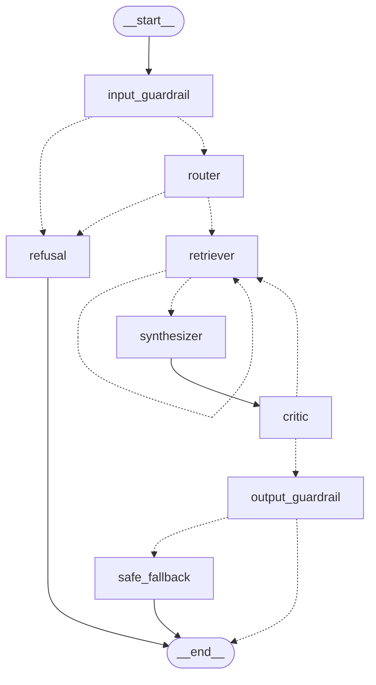

# Kestrel Labs Multi-Agent Research Assistant

A multi-agent, LangGraph-orchestrated research assistant designed to answer questions about the fictional company **Kestrel Labs** using exclusively the provided `corpus.jsonl` (154 chunks / 25 documents).


The assistant retrieves evidence, resolves coreferences, navigates temporal document conflicts, verifies claims sentence-by-sentence, enforces strict citation integrity, and audits its execution in LangSmith.

---

## 🏗️ Architecture & Topology

The system is organized as a typed `StateGraph` over a shared `TaskBoard` state object:



### Agent Roles:
1. **Input Guardrail** (`llama-3.1-8b-instant` + Regex): Deterministic length, injection, and PII checks; light 8B classifier for ambiguous queries.
2. **Router / Planner** (`llama-3.1-8b-instant`): Coreference resolution on multi-turn history, query classification (`single_hop`, `multi_hop`, `conflicting`, `unsupported`, `follow_up`, `off_topic`), and sub-query decomposition.
3. **Retriever ReAct Agent** (`llama-3.1-8b-instant`):
   - **Hybrid Search**: Dense ChromaDB cosine search + Sparse BM25 fused via Reciprocal Rank Fusion (`Σ 1 / (60 + rank)`).
   - **Local Cross-Encoder Reranker**: `cross-encoder/ms-marco-MiniLM-L-6-v2`.
   - **Neighbor Window**: `get_neighbor_chunks` for fragment continuity (`position ± 1`).
   - **Side-Channel Accumulator**: Preserves structured `RetrievedChunk` objects.
4. **Synthesizer** (`llama-3.3-70b-versatile`): Generates grounded answers with inline `[chunk_id]` citations and temporal conflict resolution (newer `published` dates win).
5. **Critic / Verifier** (`llama-3.3-70b-versatile`): Audits claims against retrieved text; assigns `supported`, `partially_supported`, `conflicting_evidence`, or `insufficient_evidence`.
6. **Output Guardrail** (`llama-3.1-8b-instant` + Deterministic checks):
   - **Citation Integrity Check**: Enforces that every cited `chunk_id` was actually retrieved. Fabricated citations trigger a hard fail.
   - **Verdict Consistency**: Ensures unhedged claims are not asserted if evidence is insufficient.

---

## 📦 Models Used

| Role | Model | Provider |
|---|---|---|
| Router, Retriever, Guardrails | `llama-3.1-8b-instant` | Groq (Free Tier) |
| Synthesizer, Critic | `llama-3.3-70b-versatile` | Groq (Free Tier) |
| Embeddings | `BAAI/bge-small-en-v1.5` | Local (sentence-transformers) |
| Reranker | `cross-encoder/ms-marco-MiniLM-L-6-v2` | Local (sentence-transformers) |

---

## 🚀 Setup & Run Instructions

### 1. Installation
Clone the repository and install dependencies:
```bash
pip install -r requirements.txt
```

### 2. Environment Configuration
Copy `.env.example` to `.env` and configure your API keys:
```bash
cp .env.example .env
```
Fill in:
```env
GROQ_API_KEY=gsk_...
LANGCHAIN_TRACING_V2=true
LANGCHAIN_API_KEY=lsv2_pt_...
LANGCHAIN_PROJECT=kestrel-research-assistant
```

### 3. One-Command Execution (End-to-End)

The entire system supports automatic ingestion and runs end-to-end with a single command:

```bash
# Option A: Interactive Terminal Assistant
python main.py

# Option B: Single-Query Execution
python main.py --query "What are Beacons in Kestrel Labs?"

# Option C: Launch Interactive Streamlit Web UI
python main.py --app
# (or: streamlit run app.py)

# Option D: Run Full Evaluation Benchmark Suite
python main.py --eval
# (or: python eval/run_eval.py)
```
*(Note: Ingestion from `corpus.jsonl` runs automatically on first launch if local indices are not yet built.)*


---

## 🔍 LangSmith Access
Access to the LangSmith project has been granted to `radialpulse@nxtwave.co.in`.
Traces include step-by-step spans for `input_guardrail_node`, `router_node`, `retriever_hybrid_search`, `retriever_rerank`, `synthesizer_node`, `critic_node`, and `output_guardrail_node`.

---

## 📊 Evaluation & Reflection

### Results Summary
Evaluation questions cover 5 categories:
- **Single-hop**: Fact retrieval from a single specification.
- **Multi-hop**: Connecting across incidents, release notes, and pricing plans.
- **Conflicting**: Detecting limits that changed over time (e.g. Starter ingest rate limit 200 -> 350 rps in v3.5).
- **Unsupported**: Gracefully declining questions not covered by the corpus.
- **Follow-up**: Multi-turn coreference resolution across turns.

See `results/metrics_summary.json` and `results/eval_results.jsonl` for exact metric scores.
See `results/improvement.md` for details on the evaluation-driven improvement.
