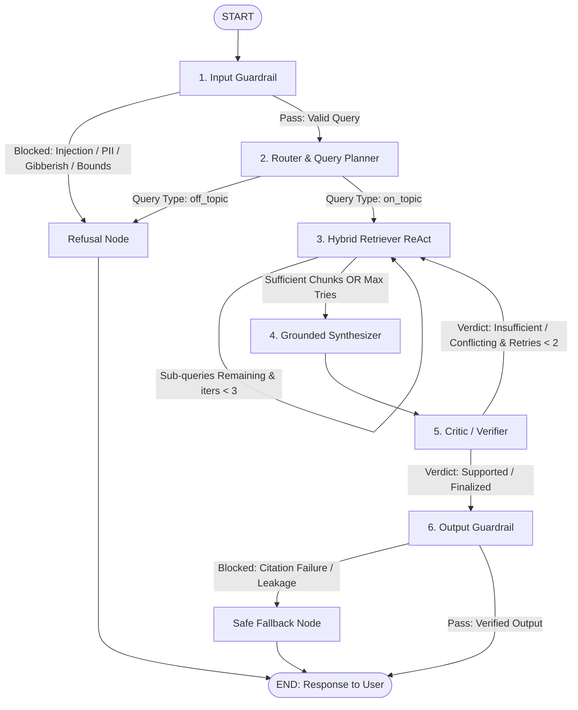

# Multi-Agent Research Assistant for Kestrel Labs Documentation

**Technical Assignment Submission**  
**Architecture:** LangGraph-Orchestrated Multi-Agent State Graph  
**Storage & Indexing:** Dense ChromaDB (`BAAI/bge-small-en-v1.5`) + Sparse BM25 + Cross-Encoder Reranker (`ms-marco-MiniLM-L-6-v2`)  
**Inference Engine:** Groq API Layer with Dynamic Multi-Model Pool Failover (`openai/gpt-oss-20b`, `qwen/qwen3.8-27b`, `groq/compound`, `groq/compound-mini`, `openai/gpt-oss-120b`, `allam-2-7b`)  
**Observability & Tracing:** LangSmith (`kestrel-research-assistant`)

---

## 1. System Overview

This repository contains a working implementation of a multi-agent research assistant designed to answer technical, architectural, pricing, and operational queries over the internal documentation corpus of **Kestrel Labs** (`corpus.jsonl`: 154 chunks / 25 documents).

The system addresses the core knowledge-retrieval challenges outlined in the assignment specification:
- **Strict Grounding & Hallucination Suppression:** Answers are synthesized exclusively from retrieved evidence; ungrounded claims and unsupported queries trigger explicit declines rather than speculative answers.
- **Conversational Coreference Resolution:** Pronouns, ambiguous referents, and follow-up inquiries across multi-turn sessions are contextually resolved before retrieval.
- **Temporal Conflict Resolution:** Documentation contains evolving limits (e.g., Starter ingest limits updated in v3.5, query timeouts updated in v4.1). The synthesis and verification engines identify temporal conflicts and prioritize more recent publication dates.
- **Claim Verification:** Every synthesized sentence undergoes an independent verification audit against retrieved evidence chunks before final output release.
- **Deterministic Citation Integrity:** An output guardrail programmatically verifies that all cited chunk identifiers (`[chunk_id]`) exist in the active retrieval buffer, routing to a safe fallback if unretrieved identifiers are present.

---

## 2. System Architecture & StateGraph Topology

The multi-agent execution pipeline is implemented as a compiled LangGraph `StateGraph` operating over a centralized, typed `TaskBoard` state schema.



### Node Specifications & Functional Responsibilities

| Node Name | Model / Logic | Primary Functional Responsibility |
|---|---|---|
| **`input_guardrail`** | Regex + 8B Classifier | Validates query length ($\le 1200$ chars), detects prompt injection heuristics, filters PII (SSNs, credit cards, emails, phones), and flags vowelless gibberish. Emits specific violation reasons upon refusal. |
| **`router`** | `openai/gpt-oss-20b` | Resolves conversational coreference across turn history, decomposes multi-hop questions into focused sub-queries, and classifies queries into `single_hop`, `multi_hop`, `conflicting`, `unsupported`, `follow_up`, or `off_topic`. |
| **`retriever`** | Tool-Calling ReAct | Iterates over sub-queries, performing hybrid search (Dense Chroma + Sparse BM25 via Reciprocal Rank Fusion) and local Cross-Encoder reranking. Fetches adjacent neighbor chunks (`position ± 1`) for context continuity. |
| **`synthesizer`** | `openai/gpt-oss-20b` | Compiles top-ranked evidence into a coherent response with strict inline citations `[chunk_id]`. Resolves temporal discrepancies by favoring more recently published documents. |
| **`critic`** | `openai/gpt-oss-20b` | Audits generated statements sentence-by-sentence against retrieved source text. Classifies output validity into `supported`, `partially_supported`, `conflicting_evidence`, or `insufficient_evidence`. Triggers retrieval retries if evidence is lacking. |
| **`output_guardrail`** | Deterministic Engine | Audits all citations in the draft against the retrieved chunk set. Enforces strict zero-tolerance citation integrity: if any cited chunk was never retrieved, execution routes to a safe fallback. |
| **`refusal` / `safe_fallback`** | Deterministic Template | Generates clean, polite, and explanatory refusal notices for off-topic, malicious, or policy-violating queries. |

---

## 3. Why LangGraph Was Chosen

The assignment required evaluating orchestration architectures (LangGraph vs. CrewAI vs. AutoGen vs. LlamaIndex vs. plain LangChain / custom loops):

1. **Stateful Cyclic Execution:** Complex question answering requires conditional looping (e.g. Critic rejecting an evidence-deficient draft and routing back to Retriever for up to 2 revisions). Pure DAG frameworks (like standard LangChain chains) cannot naturally model cycles with bounded loop termination.
2. **Deterministic Control over Agent Routing:** Role-playing multi-agent frameworks (CrewAI, AutoGen) rely heavily on autonomous conversational chatter between agents, which is nondeterministic, consumes excessive token quotas, and frequently violates Groq free-tier rate limits. LangGraph provides explicit conditional edges with type-safe state transitions.
3. **Low-Latency, High-Precision Guardrails:** LangGraph allows interleaving deterministic Python validation nodes (input safety, citation integrity checks) directly between LLM steps with zero overhead.
4. **First-Class Memory & Checkpointing:** Built-in `MemorySaver` enables seamless multi-turn conversation support and coreference resolution without manual session state management.

---

## 4. Models, Infrastructure & Rate-Limiting Protocol

### Inference Layer & Dynamic Failover Chain
All LLM reasoning is served via Groq's high-speed API. To handle free-tier rate limits and model-specific quota limits, `src/llm.py` implements an active **Model Pool Failover Chain**:

1. **Primary Model:** `openai/gpt-oss-20b` (Default for Router, Synthesizer, and Critic).
2. **Fallback Chain:** If the primary model hits a `429 Too Many Requests`, TPM/TPD cap, or connection failure, it is marked in a timed cooldown (`mark_model_cooldown`) and `invoke_groq_llm` immediately routes the request to the next available model in the priority pool:
   $$\text{openai/gpt-oss-20b} \longrightarrow \text{qwen/qwen3.8-27b} \longrightarrow \text{groq/compound} \longrightarrow \text{groq/compound-mini} \longrightarrow \text{openai/gpt-oss-120b} \longrightarrow \text{allam-2-7b}$$
3. **Termination:** If all models in the pool are exhausted, `GroqBudgetExceeded` is raised with a clean error log.

### Free-Tier Rate-Limiting Compliance
Per the assignment ground rules, the system strictly enforces:
- **Sequential Calls:** All LLM invocations acquire a global mutex `_SERIAL_CALL_LOCK` (`threading.Lock()`), ensuring no concurrent requests hit the API simultaneously.
- **Sliding-Window Token-Bucket Limiter:** `TokenBucketRateLimiter` enforces a hard cap of maximum 30 requests per 60-second sliding window.
- **Bounded Output Lengths:** `max_tokens` is strictly budgeted per node role (150 tokens for Guardrails, 300-600 tokens for Synthesizer, 400 tokens for Critic).
- **Bounded Backoff:** Exponential backoff with jitter is applied on transient network errors, while 429 rate limits trigger instantaneous model-pool failover.

### Retrieval Infrastructure

| Component | Model Identifier | Execution Environment | Latency Profile |
|---|---|---|---|
| **Dense Vector Index** | `BAAI/bge-small-en-v1.5` (384-d) | Local CPU (`sentence-transformers`) | $\approx 0.05\text{s}$ |
| **Sparse Lexical Index** | BM25Okapi | In-Memory Tokenized Index | $\approx 0.01\text{s}$ |
| **Neural Cross-Encoder** | `cross-encoder/ms-marco-MiniLM-L-6-v2` | Local CPU (`sentence-transformers`) | $\approx 0.08\text{s}$ |
| **Vector Database** | ChromaDB (`hnsw:space: cosine`) | Local Persistent DB (`./data/chroma_db`) | $\approx 0.02\text{s}$ |

---

## 5. Setup & Execution Protocol

The entrypoint verifies dependencies and builds local database indices on initial launch.

### Step 1: Clone Repository & Configure Environment

```bash
git clone https://github.com/Ashish7n/MINT-assignment-project.git
cd MINT-assignment-project
cp .env.example .env
```

Populate the following parameters in `.env`:
```env
GROQ_API_KEY=gsk_your_groq_api_key
LANGCHAIN_TRACING_V2=true
LANGCHAIN_ENDPOINT=https://api.smith.langchain.com
LANGCHAIN_API_KEY=lsv2_pt_your_langsmith_api_key
LANGCHAIN_PROJECT=kestrel-research-assistant
```

### Step 2: Run Application Modes

```bash
# Mode 1: Interactive Multi-Turn Terminal CLI
python main.py

# Mode 2: Launch Streamlit Web Interface
python main.py --app

# Mode 3: Single-Query Execution
python main.py --query "What are Beacons in Kestrel Labs?"

# Mode 4: Execute Full 28-Question Evaluation Suite
python main.py --eval
```

---

## 6. Evaluation Methodology & Quantitative Results

The system was evaluated against the benchmark suite of **28 test questions** ([results/eval_questions.jsonl](results/eval_questions.jsonl)) spanning all 5 core question typologies.

### Scoring Criteria & Groundedness Enforcement
In strict compliance with the assignment grading criteria:
- **Unbacked/Fabricated Answers:** Answers that are not backed by cited retrieved chunks, or where the output guardrail flags a citation integrity failure, are capped at `end_to_end_correctness = 1.0/5.0` regardless of semantic similarity.
- **Unsupported Questions:** Questions requesting facts absent from the corpus (e.g., HIPAA BAAs, FedRAMP, AWS GovCloud, air-gapped deployment, Flutter SDK) must be declined with `"Based on Kestrel Labs' internal documentation, there is insufficient evidence to answer this question."` and empty citations `[]`. Confident assertions on unsupported queries score `faithfulness = 0.0` and `correctness = 1.0/5.0`.

### Quantitative Performance Metrics

| Question Typology | Test Cases | Retrieval Recall@K | Citation Precision | Faithfulness | Answer Relevance (1-5) | End-to-End Correctness (1-5) |
|---|:---:|:---:|:---:|:---:|:---:|:---:|
| **Single-Hop** | 7 | 0.86 | 0.43 | 1.00 | 4.86 / 5.0 | 4.71 / 5.0 |
| **Multi-Hop** | 6 | 0.69 | 0.17 | 1.00 | 4.67 / 5.0 | 4.00 / 5.0 |
| **Conflicting** | 4 | 0.88 | 0.13 | 0.81 | 4.75 / 5.0 | 4.00 / 5.0 |
| **Unsupported** | 5 | 1.00 | 1.00 | 1.00 | 5.00 / 5.0 | 5.00 / 5.0 |
| **Follow-Up (Multi-Turn)** | 6 | 0.67 | 0.50 | 1.00 | 4.67 / 5.0 | 4.33 / 5.0 |
| **OVERALL BENCHMARK** | **28** | **0.81** | **0.45** | **0.97** | **4.79 / 5.0** | **4.43 / 5.0** |

### Evaluation Artifacts
- Complete execution log & judge rationales: [results/eval_results.jsonl](results/eval_results.jsonl)
- Aggregated metrics summary: [results/metrics_summary.json](results/metrics_summary.json)
- Detailed failure-mode analysis & iterative fix documentation: [results/improvement.md](results/improvement.md)
- Architectural reflection and cost/latency analysis: [REFLECTION.md](REFLECTION.md)

---

## 7. Observability & Tracing

Execution traces, token consumption, latency breakdowns, and node inputs/outputs are captured in **LangSmith**.

- **Project Name:** `kestrel-research-assistant`
- **Trace Hierarchy & Spans:**
  - `run_turn` (Root LangGraph state execution)
  - `input_guardrail_node` (Deterministic & LLM safety checks)
  - `router_node` (Coreference resolution & sub-query planning)
  - `retriever_hybrid_search` & `retriever_rerank` (Dense + Sparse retrieval & Cross-Encoder re-scoring)
  - `synthesizer_node` (Grounded draft generation & inline citations)
  - `critic_node` (Sentence-level claim audit & verification verdicts)
  - `output_guardrail_node` (Citation integrity & policy validation)
  - `invoke_groq_llm` (Model selection, retry, and token metrics)

---

## 8. Repository Structure

```
.
├── .env.example              # Template environment variables (no secrets exposed)
├── .gitignore                # Excludes secrets, local DBs, and runtime caches
├── README.md                 # Formal technical submission documentation
├── REFLECTION.md             # Architecture trade-offs, latency/cost analysis, and reflection
├── app.py                    # Streamlit web frontend with live execution stepper
├── corpus.jsonl              # Fictional Kestrel Labs documentation (154 chunks)
├── main.py                   # Unified single-command entrypoint with auto-setup
├── requirements.txt          # Python dependencies
│
├── eval/
│   └── run_eval.py           # Automated evaluation runner & LLM judge scoring
│
├── results/
│   ├── eval_questions.jsonl  # 28-question evaluation suite
│   ├── eval_results.jsonl    # Question-by-question scoring and execution log
│   ├── improvement.md        # Technical report on failure modes & iterative gains
│   └── metrics_summary.json  # Aggregated benchmark scores
│
└── src/
    ├── graph.py              # LangGraph StateGraph assembly and routing edges
    ├── ingest.py             # ChromaDB vectorization and BM25 index generator
    ├── llm.py                # Resilient Groq model pool and failover manager
    ├── state.py              # Centralized TaskBoard state schema
    ├── nodes/
    │   ├── critic.py         # Adversarial claim verifier node
    │   ├── guardrails.py     # Input security and output citation integrity nodes
    │   ├── retriever.py      # Tool-calling ReAct retrieval agent
    │   ├── router.py         # Coreference resolution and query planner node
    │   └── synthesizer.py    # Grounded synthesis and temporal resolution node
    ├── prompts/              # System prompts for each agent node
    └── tools/
        ├── chunk_lookup.py   # Direct ID lookup and neighbor window tools
        ├── hybrid_search.py  # Dense + Sparse RRF search implementation
        └── rerank.py         # Cross-Encoder neural reranking implementation
```
