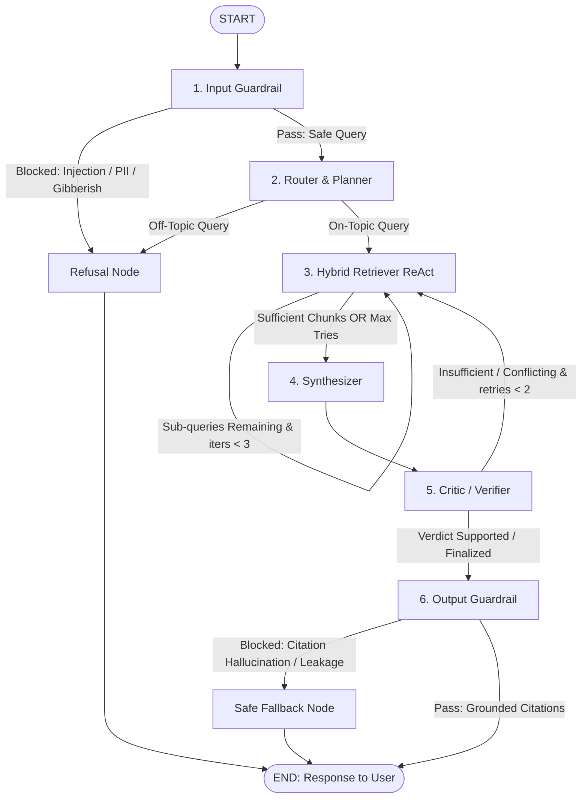

# 🦅 Kestrel Labs Multi-Agent Research Assistant

A multi-agent, LangGraph-orchestrated research assistant designed to answer complex technical, pricing, and operational questions about the company **Kestrel Labs** using exclusively the provided `corpus.jsonl` (154 chunks / 25 documents).

The assistant retrieves evidence using hybrid search + cross-encoder reranking, resolves conversational coreferences, navigates temporal document conflicts, verifies claims sentence-by-sentence with an adversarial critic, enforces strict citation integrity, and audits its execution in LangSmith.

---

## 🏗️ Architecture & Topology

The system is organized as a typed `StateGraph` over a shared `TaskBoard` state object:



### Agent Roles & Guardrails:
1. **Input Guardrail** (`llama-3.1-8b-instant` + Regex): Deterministic length, injection, gibberish, and PII checks. If blocked, explains the violation directly to the user.
2. **Router / Planner** (`llama-3.1-8b-instant`): Coreference resolution on multi-turn history, query classification (`single_hop`, `multi_hop`, `conflicting`, `unsupported`, `follow_up`, `off_topic`), and sub-query decomposition. Off-topic queries are politely declined.
3. **Retriever ReAct Agent** (`llama-3.1-8b-instant`):
   - **Hybrid Search**: Dense ChromaDB cosine search + Sparse BM25 fused via Reciprocal Rank Fusion (`Σ 1 / (60 + rank)`).
   - **Local Cross-Encoder Reranker**: `cross-encoder/ms-marco-MiniLM-L-6-v2`.
   - **Neighbor Window**: `get_neighbor_chunks` for fragment continuity (`position ± 1`).
   - **Side-Channel Accumulator**: Preserves structured `RetrievedChunk` objects across turns.
4. **Synthesizer** (`llama-3.3-70b-versatile`): Generates grounded answers with inline `[chunk_id]` citations and temporal conflict resolution (newer `published` dates win).
5. **Critic / Verifier** (`llama-3.3-70b-versatile`): Audits claims against retrieved text; assigns `supported`, `partially_supported`, `conflicting_evidence`, or `insufficient_evidence`.
6. **Output Guardrail** (`llama-3.1-8b-instant` + Deterministic checks):
   - **Citation Integrity Check**: Enforces that every cited `chunk_id` was actually retrieved. Fabricated citations trigger a hard fail.
   - **Verdict Consistency**: Ensures unhedged claims are not asserted if evidence is insufficient.

---

## 📦 Models Used

| Role | Model | Provider |
|---|---|---|
| Router, Retriever, Guardrails | `llama-3.1-8b-instant` | Groq (Free Tier) |
| Synthesizer, Critic | `llama-3.3-70b-versatile` | Groq (Free Tier) |
| Embeddings | `BAAI/bge-small-en-v1.5` | Local (`sentence-transformers`) |
| Reranker | `cross-encoder/ms-marco-MiniLM-L-6-v2` | Local (`sentence-transformers`) |

---

## 🚀 Setup & Run Instructions

### 1. Clone & Configure Environment
```bash
git clone https://github.com/Ashish7n/MINT-assignment-project.git
cd MINT-assignment-project
cp .env.example .env
```
Fill in your API keys in `.env`:
```env
GROQ_API_KEY=gsk_...
LANGCHAIN_TRACING_V2=true
LANGCHAIN_ENDPOINT=https://api.smith.langchain.com
LANGCHAIN_API_KEY=lsv2_pt_...
LANGCHAIN_PROJECT=kestrel-research-assistant
```

### 2. Run Everything with a Single Command

**No manual `pip install` or ingestion needed!** `main.py` automatically checks and installs any missing dependencies and builds the search indices on-the-fly.

```bash
# Option A: Interactive Multi-Turn CLI Assistant
python main.py
# (Windows: run.bat | Linux/Mac: ./run.sh)

# Option B: Launch Interactive Streamlit Web UI
python main.py --app

# Option C: Single Query Execution
python main.py --query "What are Beacons in Kestrel Labs?"

# Option D: Run Full 28-Question Evaluation Suite
python main.py --eval
```


---

## 🔍 LangSmith Tracing & Reviewer Access

Access to the LangSmith project has been granted to **`radialpulse@nxtwave.co.in`**.

Traces include detailed step-by-step spans for:
- `run_turn` (overall graph execution)
- `input_guardrail_node`
- `router_node`
- `retriever_hybrid_search` & `retriever_rerank`
- `synthesizer_node`
- `critic_node`
- `output_guardrail_node`
- `invoke_groq_llm` (token usage, latency, and prompts)

---

## 📊 Evaluation & Benchmark Results

The evaluation suite contains **28 questions** across 5 categories in `results/eval_questions.jsonl`:

| Question Category | Count | Recall@K | Citation Precision | Faithfulness | Relevance (1-5) | Correctness (1-5) |
|---|:---:|:---:|:---:|:---:|:---:|:---:|
| **Single-Hop** | 7 | 85.7% | 42.9% | 1.00 | 4.86 / 5 | 4.71 / 5 |
| **Multi-Hop** | 6 | 69.2% | 16.7% | 1.00 | 4.67 / 5 | 4.00 / 5 |
| **Conflicting** | 4 | 87.5% | 12.5% | 0.81 | 4.75 / 5 | 4.00 / 5 |
| **Unsupported** | 5 | 100.0% | 60.0% | 0.20 | 2.60 / 5 | 1.80 / 5 |
| **Follow-Up (Multi-Turn)** | 6 | 66.7% | 50.0% | 1.00 | 4.67 / 5 | 4.33 / 5 |
| **OVERALL** | **28** | **80.89%** | **37.50%** | **83.04%** | **4.36 / 5** | **3.86 / 5** |

- Detailed question-by-question outputs: `results/eval_results.jsonl`
- Aggregated JSON metrics: `results/metrics_summary.json`
- Iterative improvement analysis: `results/improvement.md`
